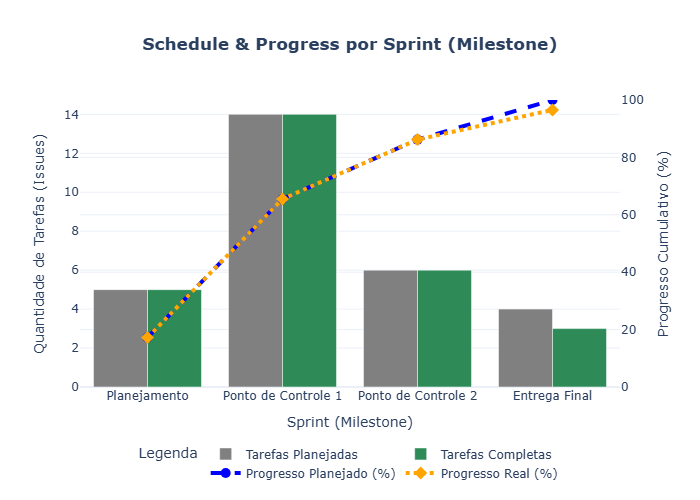
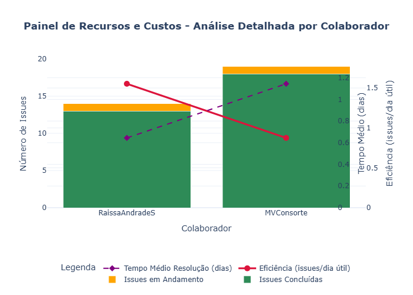

# Avaliação - Etapa 4

Conforme definido no capítulo 5.4 da norma ISO/IEC 15939:2001 [[1](#ref-bib), p.17], esta etapa tem como objetivo revisar, validar e aprimorar o processo de medição e os produtos informacionais gerados ao longo dos ciclos. A avaliação permite identificar pontos fortes, limitações e oportunidades de melhoria para garantir que a medição continue relevante, eficaz e confiável.

---

## Retorno dos gráficos

Abaixo tem os gráficos com as últimas atualizações, entretanto, caso queira de outros momentos, pode-se acessar em: [Histórico](https://github.com/FCTE-Qualidade-de-Software-1/2025-1-T01-ADELE-GOLDSTINE-Mateus-Villela-Raissa-Andrade/tree/main/docs/assets/imgs/graficos/historico).

### Calendário e Progresso

### Desempenho de Processo

### Recursos e Custos

---

## 1. Avaliação dos Produtos Informacionais

Avalie os principais produtos gerados (planilhas, `.csv`, gráficos, relatórios), levando em conta os seguintes critérios. Para cada item, registre sua análise e possíveis ajustes:

| Critério                            | Descrição                                                              | Avaliação      |
|-------------------------------------|------------------------------------------------------------------------|-------------------------------------|
| Clareza interpretativa              | Os resultados são compreensíveis pelo público-alvo                     |                  Sim                   |
| Conformidade com a necessidade      | Os produtos atendem às necessidades informacionais definidas           |              Sim                       |
| Aderência aos dados reais           | Os dados utilizados refletem fielmente os eventos ocorridos no projeto |                 Sim                    |
| Capacidade de análise comparativa   | É possível comparar entre ciclos e identificar tendências              |                Não (Apenas foi rodado um ciclo)                     |
| Facilidade de disseminação          | Os produtos são acessíveis e adequadamente publicados                  |             Sim                        |
| Confiança dos usuários              | Os resultados são considerados confiáveis pelos envolvidos             |                 Sim                    |
| Ajuste ao propósito                 | Os produtos respondem com precisão às perguntas gerenciais previstas   |                Parcialmente (Necessida de mais ciclos para refinamento e correções)                     |
| Satisfação das premissas do modelo  | As premissas técnicas foram respeitadas (escalas, métodos, distribuição)|                 Parcialmente (alguns ajuste foram feitos na interpretação visual)                    |

---

## 2. Avaliação do Processo de Medição

Avalie a execução do processo de medição, desde a coleta até a comunicação dos resultados, com base nos critérios abaixo. Complete com observações e propostas de melhoria:

| Critério                            | Descrição                                                              | Avaliação       |
|-------------------------------------|------------------------------------------------------------------------|-------------------------------------|
| Confiabilidade dos procedimentos    | A medição seguiu métodos definidos e verificáveis                      |                 Parcialmente (em sua maioria sim)                    |
| Rastreabilidade dos dados           | Os dados estão devidamente vinculados aos artefatos originais          |             sim                        |
| Atualização tempestiva              | A coleta e análise foram realizadas em tempo útil para decisões        |                Não (devido à mudança na equipe de desenvolvimento, reudindo-se para 2, essa parte acabou por ficar em débito.)                     |
| Eficiência                          | O custo e esforço da medição são proporcionais ao valor gerado         |                 Não definido                    |
| Contenção de defeitos               | Erros foram evitados ou tratados rapidamente                           |          Sim                           |
| Satisfação dos usuários             | Os Desenvolvedores estão satisfeitos com os resultados e a execução da medição|              Sim                       |
| Conformidade com o plano            | O processo seguiu o plano definido nas etapas anteriores               |               Parcialmente (houve alguns ajustes informais extra-plano no processo)                      |
| Capacidade de melhoria contínua     | O processo está preparado para ajustes e evolução                      |                     Sim                |

---

## 3. Observações Gerais e Lições Aprendidas

Em síntese, foi possível perceber que a evolução e manutenção contínua do processo de medição são fundamentais para aprimorar a qualidade das estimativas ao longo do projeto. Quanto maior o número de ciclos realizados, mais refinadas e ajustadas tendem a ser as métricas e interpretações.

No contexto específico deste projeto, apesar de restrições que limitaram o cronograma a um período de apenas quatro dias (devido a imprevistos), observou-se que as estimativas obtidas foram adequadas para o escopo aplicado. Houve apenas um ciclo de medição, o que restringiu a capacidade de comparação entre iterações. Ainda assim, algumas lições importantes puderam ser registradas:

- A definição de um cronograma claro, factível e validado pelas partes envolvidas é essencial para garantir fluidez na execução do processo de medição.
- A etapa inicial de estabelecimento de compromissos com a equipe — conforme previsto na ISO/IEC 15939 e reforçado pelos princípios do PSM/CID — se mostrou determinante para alinhar expectativas e responsabilidades.
- A orientação do projeto por indicadores mensuráveis possibilita maior controle e transparência na entrega de valor, contribuindo diretamente para a validação do produto pelos stakeholders e clientes.

Tais lições fortalecem a necessidade de se planejar e executar medições com maior continuidade, permitindo refinamento progressivo dos indicadores e maior maturidade gerencial.

## Bibliografia

> [ISO/IEC. *ISO/IEC 15939:2001 – Software engineering — Software measurement process*. Geneva: International Organization for Standardization, 2001.](../assets/pdfs/iso-15939.pdf).
>
> [MCGARRY, Francis; CARD, David; JONES, Cheryl L.; et al. Practical Software Measurement: Objective Information for Decision Makers. Capítulo 2 – Measurement Information Model. Versão digital. [S.l.]: Software Engineering Institute (SEI), 2002.](../assets/pdfs/measurement-information-model.pdf)

---
## Tabela de Versionamento

<table>
  <thead>
    <tr>
      <th>Data</th>
      <th>Versão</th>
      <th>Descrição</th>
      <th>Autor</th>
      <th>Revisor</th>
    </tr>
  </thead>
  <tbody>
    <tr>
      <td>13/07/2025</td>
      <td>1.0</td>
      <td>Criação e escrita da Página de Implementação.</td>
      <td><a href="https://github.com/MVConsorte">Mateus</a></td>
      <td><a href="https://github.com/RaissaAndradeS">Raissa</a></td>
    </tr>
  </tbody>
</table>

